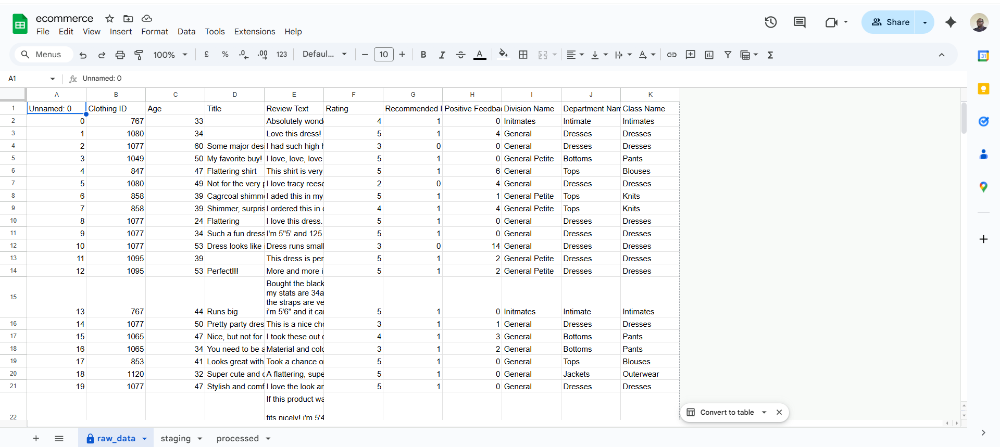
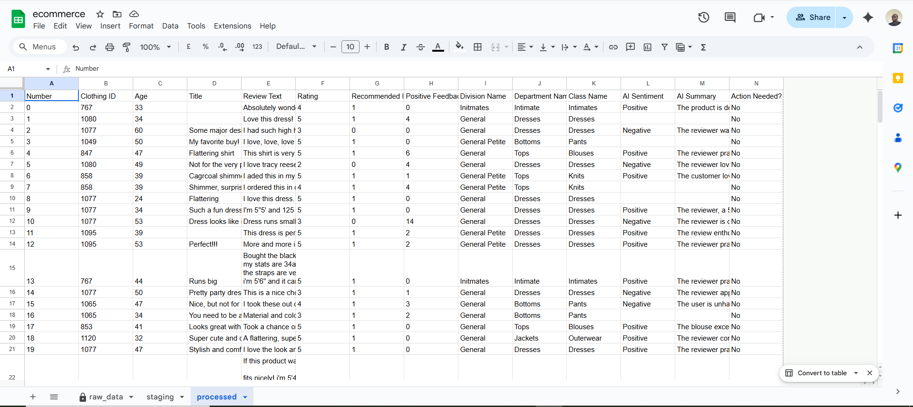

## Women Brand Seller Reviews

# Introduction

The goal of this assignment is to build an automated review-analysis pipeline for analyzing reviews made by women shopping on an online store  using:

Python
Google Sheets (via GSpread)
Groq LLM (model: openai/gpt-oss-20b)

# Dataset Overview
The data is provided by kaggle and contains a list of outfits and their reviews.

This dataset contains customer reviews along with multiple metadata fields. Review text has been anonymized; brand replaced with "retailer" for data privacy.

# Images

Other analysis files can be located in the reports folder

# How to reproduce
1. ensure you have poetry installed on your pc.
2. clone or download the repo
3. open the project folder
4. run the command poetry install
5. wait a few minutes for setup to complete
6. run the command poetry run ecom-pipeline